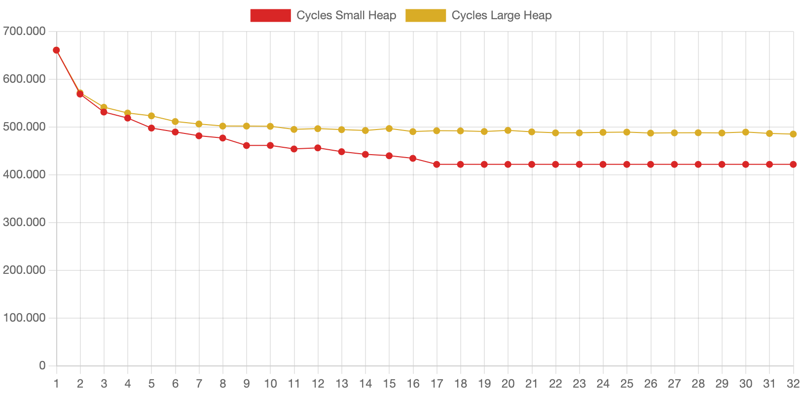

# Abschlussbericht

> Im Rahmen des Praktikums wurde der Einfluss von Translation-Lookaside-Buffers(TLBs) mithilfe  
> einer selbstgeschriebenen Simulation untersucht.

## 1 - Ergebnisse der Literaturrecherche

### Übliche Größen für TLBs

Je nach Cache-Level kann die Größe eines TLBs stark variieren (siehe [TLB.md](./docs/TLB.md#übliche-größe)):

| TLB         | Architektur                                                                                                    | Größe                | 
|-------------|----------------------------------------------------------------------------------------------------------------|----------------------| 
| L1          | Apple M2, M3, A15 Bionic [[3]](./docs/sources.md#3-apple-silicon-cpu-optimization-guide)                       | 192 / 256 Einträge   |
| L2          | AMD Zen (17h) [[5]](./docs/sources.md#5-amd-zen-reference)                                                     | 1536 / 1024 Einträge |
| DTLB / STLB | Intel (Sandy Bridge) [[4]](./docs/sources.md#4-intel-64-and-ia-32-architectures-optimization-reference-manual) | 64 / 512 Einträge    |

### Übliche Architekturen für TLBs

TLBs finden sich heutzutage in jeder oft eingesetzten Architektur, egal ob in RISC Systemen (z.B. MIPS oder Alpha) oder
CISC Systemen (z.B. x86).

### Hauptspeicher- und TLB-Latenzen

Die Latenz ist hier die Latenz des RAM selber und nicht die Systemlatenz. Die Systemlatenz ist stark
vom Prozessor abhängig. Generell kann man bei ihr von ca. ~60 - 100 ns ausgehen.

| RAM                                                                                                       | Latenz   |
|-----------------------------------------------------------------------------------------------------------|----------|
| DDR5-4800-CL36 [[7]](./docs/sources.md#7-ddr5-latenzen)[[6]](./docs/sources.md#6-anandtech-ddr5-ram-test) | ~14 ns   | 
| DDR5-6800-CL36 [[7]](./docs/sources.md#7-ddr5-latenzen)                                                   | 10.56 ns | 
| DDR4-3200-CL14 [[7]](./docs/sources.md#7-ddr5-latenzen)                                                   | 8.75 ns  | 

| TLB                                                                                                 | Latenz         |
|-----------------------------------------------------------------------------------------------------|----------------|
| DTLB (L1) [[4]](./docs/sources.md#4-intel-64-and-ia-32-architectures-optimization-reference-manual) | 4 Zyklen       |
| TLB (L2) [[1]](./docs/sources.md#1-computer-organization-and-design)                                | 10 - 30 Zyklen |

## 2 - Simulation der Summe über eine verkettete Liste

Siehe [docs/sum.md](./docs/sum.md) für eine detaillierte Version des Beispiels.

### Simulation

Die Simulation wird mit einer verketten Liste von 1000 Knoten durchgeführt.
Diese sind auf einem Heap der Größe
`256MiB`([./examples/linked_list_large_heap.csv](./examples/linked_list_large_heap.csv)) und auf einem Heap der
Größe `64KiB` ([./examples/linked_list_small_heap.csv](./examples/linked_list_small_heap.csv)) verteilt.
Die TLB Größe wurde von 1 bis 32 Einträgen variiert. Es wurden die default Werte für alle Parameter verwendet.

### Ergebnisse

#### Großer Heap

#### Kleiner Heap

#### Direkter Vergleich

### Fazit

Die Anzahl der benötigten Zyklen ist von der räumlichen Lokalität der Speicherzugriffe abhängig. Liegen alle Adressen
nah beieinander oder in einer geringen Anzahl von Blöcken, so kann die Anzahl der
Misses auf ein Minimum reduziert
werden (siehe [kleiner heap](#kleiner-heap)). Liegen die Adressen jedoch alle in verschiedenen Speicherblöcken, tritt
bei jedem neuen
Knoten
ein neuer Conflict Miss auf (siehe [großer heap](#großer-heap)).

### Speedup

Die Ausführungszeit ohne TLB würde bei `numReq * 2 * memLatency = 6006 * 2 * 60 = 720720` Zyklen liegen. Selbst bei
schlechter räumlicher
Lokalität (wie im [großen Heap Beispiel](#großer-heap)) kann durch das Cachen des
Stackpointers
ein Speedup von `1.46` facher Geschwindigkeit erreicht werden. Bei guter räumlicher Lokalität (wie
im [kleiner Heap Beispiel](#kleiner-heap))
ist sogar ein Speedup von `1.71` möglich.

## 3 - persönliche Beiträge der Gruppenmitglieder

### Kian Shirazi

- ArgParser
- Bugfixes
- Recherche zu TLB Größen / Latenz, Memory Latency

### James Wagner

- Build System, C, C++ Standard Anpassungen
- CSVParser
- Bugfixes

### Simon Weckler

- TLB Simulation (C++)
- Analyse zur Summe über eine verkettete Liste
