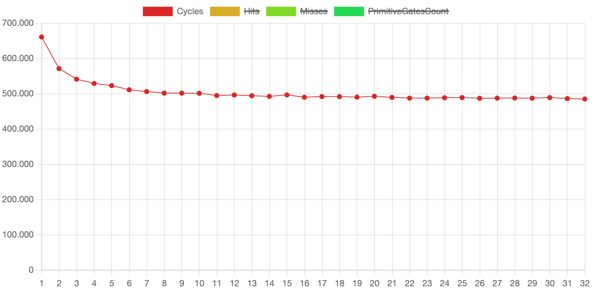
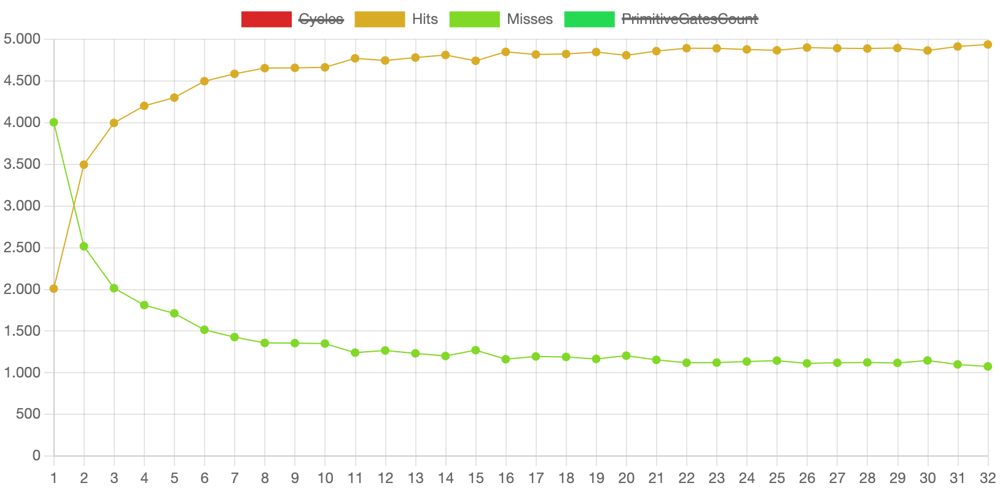
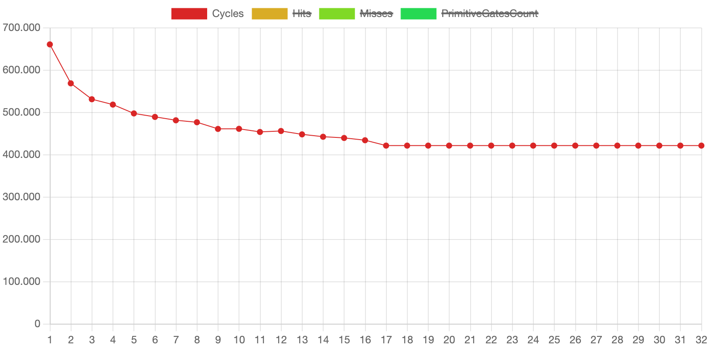
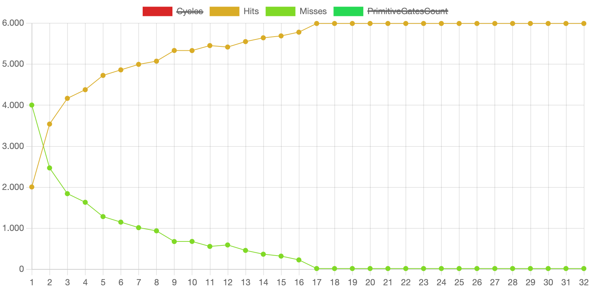

[//]: # (Was muss hier rein?)
[//]: # (1. persönlichen Beitrag jedes Gruppenmitglieds)
[//]: # (2. Ergebnisse der Recherche: übliche Größen, Architekturen für TLBs sowie Hauptspeicher und TLB Latenzen in modernen Prozessoren)
[//]: # (3. Ergebnisse der Simulation der Summe über eine linked List zusammenfassen)

# 1 - Persönliche Beiträge der Gruppenmitglieder
## Kian Shirazi (go68num)
- Arg Parser
- Bugfixes
- Research zu TLB Größen, Memory Latency, usw.

## James Wagner (ge45cos)
- Build System / Make System / Lib Management / C Standard Anpassungen
- CSV Parser
- Bugfixes
- Research zu zukünftiger Verwendung von TLBs

## Simon Weckler (ge45wun)
- C++ Teil
- Simulation
- Research zur Summe über eine verkettete Liste + Helper Scripts

---

# 2 - Ergebnisse der Literaturrecherche

## Übliche Größen für TLBs
Je nach Art und Anwendung kann die Größe eines TLBs stark variieren:

| TLB  | Architektur                                                                                                                  | Größe                | 
|------|------------------------------------------------------------------------------------------------------------------------------|----------------------| 
| L1   | Apple M1 [[1]](./docs/sources.md#apple-silicon-cpu-optimization-guide)                                                       | 128 / 160 Einträge   |
| L1   | Apple M2, M3, A15 Bionic [[1]](./docs/sources.md#apple-silicon-cpu-optimization-guide)                                       | 192 / 256 Einträge   |
| L2   | AMD Zen (17h) [[2]](./docs/sources.md#amd-zen-reference)                                                                     | 1536 / 1024 Einträge |
| DTLB | Intel Sandy Bridge Microarchitecture [[3]](./docs/sources.md#intel-64-and-ia-32-architectures-optimization-reference-manual) | 4 / 64 Einträge      |
| STLB | Intel Sandy Bridge Microarchitecture [[3]](./docs/sources.md#intel-64-and-ia-32-architectures-optimization-reference-manual) | 512 Einträge         | 

## Übliche Architekturen für TLBs
TLBs finden sich heutzutage in jeder oft eingesetzten Architektur, egal ob in RISC Systemen (z.B. MIPS oder Alpha) oder CISC Systemen (z.B. x86).

## Hauptspeicher- und TLB-Latenzen in modernen Prozessoren

Für die Hauptspeicher-Latenzen haben wir uns auf Werte aus zwei Modernen Prozessoren konzentriert: Den Apple M1, der Anwendung in Macs und iPads findet und den DDR5 RAM, der sowohl in den neuesten Intel (Gen. 12+) als auch den aktuellsten AMD Prozessoren, der Ryzen 9 Serie, eingesetzt wird. Des weiteren haben wir den Vergleich zu einem SDRAM aus 1993 gezogen.
Dafür ergeben sich folgende Werte:

| Prozessor / RAM                                           | Latenz |
|-----------------------------------------------------------|--------|
| Apple M1 [[4]](./docs/sources.md#anandtech-apple-m1-test) | 96ns   | 
| DDR5 [[5]](./docs/sources.md#anandtech-ddr5-ram-test)     | ~14ns  | 
| SDRAM [[5]](./docs/sources.md#anandtech-ddr5-ram-test)    | ~24ns  |

Für die TLB-Latenzen finden sich ganz unterschiedliche Werte, je nach Anwendung und Größe des TLBs. Hier einige Beispiele:

| TLB                                                                                           | Latenz         |
|-----------------------------------------------------------------------------------------------|----------------|
| DTLB [[3]](./docs/sources.md#intel-64-and-ia-32-architectures-optimization-reference-manual)  | 4 cycles       |
| L2 Cache [[6]](./docs/sources.md#memory-hierarchy-reconfiguration-for-energy-and-performance) | 21 cycles      |
| TLB [[7]](./docs/sources.md#computer-organization-and-design)                                 | 11 - 30 cycles |

---

# 3 - Simulation der Summe über eine verkettete Liste

**DISCLAIMER**: Eine detaillierte Analyse ist in [docs/sum.md](./docs/sum.md) zu finden.

### Speicherzugriffe

1. Initialisierung:
    1. pointer auf aktuellen Knoten wird vom Stack gelesen
    2. Summe wird auf dem Stack mit 0 initialisiert

2. Schleife:
    1. Adresse auf Knoten wird vom Stack gelesen
    2. Daten des Knoten werden vom Heap gelesen
    3. Summe wird vom Stack gelesen
    4. Summe + Daten des Knotens wird auf dem Stack gespeichert
    5. Pointer auf nächsten Knoten wird vom Heap gelesen
    6. Pointer auf nächsten Knoten wird auf den Stack geschrieben

### Simulation

Die Simulation wird mit einer verketten Liste von 1000 Knoten durchgeführt.
Diese sind einmal auf einem Heap der Größe
`256MiB`([./examples/linked_list_large_heap.csv](./examples/linked_list_large_heap.csv)) und einmal auf einem Heap der
Größe `64KiB` ([./examples/linked_list_small_heap.csv](./examples/linked_list_small_heap.csv)) verteilt.
Die TLB Größe wurde von 1 bis 32 Einträgen variiert.

### Ergebnisse

#### Großer Heap

#### Kleiner Heap

### Fazit

Die Miss Rate des TLBs und damit auch die Anzahl der benötigten Zyklen bei einer
Summe über eine verkettete List extrem von der räumlichen Lokalität der Speicherzugriffe abhängig. Liegen alle Adressen
nah beieinander oder in einer geringen Anzahl von Blöcken, so kann die Anzahl der
Misses auf ein Minimum reduziert
werden (siehe [kleiner heap](#kleiner-heap)). Liegen die Adressen jedoch alle in verschiedenen Speicherblöcken, tritt
bei jedem neuen
Knoten
ein neuer Conflict Miss auf (siehe [großer heap](#großer-heap)).

#### Speedup

Der Speedup ist stark von der räumlichen Lokalität der Speicherzugriffe abhängig. Trotzdem lassen
sich einige Aussagen treffen. Die Ausführungszeit ohne TLB würde bei `6006 * 2 * 60 = 720720` (immer 1 zusätzlicher
Speicherzugriff für die Adressübersetzung, bei 60 Zyklen Speicherlatenz) liegen.

Selbst bei schlechter räumlicher Lokalität (wie im [großen Heap Beispiel](#großer-heap)) kann durch das Cachen des
Stackpointers
ein Speedup von ca. `30%` erreicht werden. Bei guter räumlicher Lokalität (wie
im [kleiner Heap Beispiel](#kleiner-heap))
ist sogar ein Speedup von ca. `40%` möglich. Es ist also definitiv sinnvoll, einen TLB in Prozessoren zu verwenden.

---

Quellen und Literaturreferenzen finden sich in [./docs/sources.md](./docs/sources.md) oder direkt in den Fußnoten.
