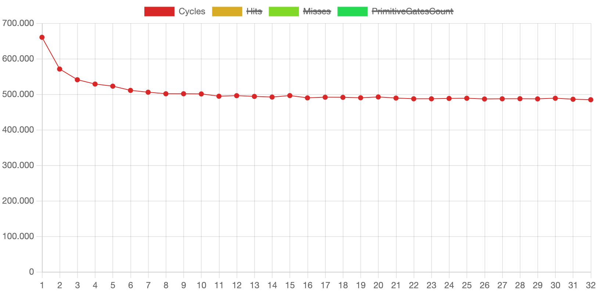

# Summe über eine verkettete Liste

## Speicherzugriffe

Um herauszufinden, wie sich die Speicherzugriffe auf bei einer Summe über eine verkettete Liste verhalten, werden wir
folgendes C Programm betrachten:

```c
#include <stdio.h>

/* A Linked list node */
struct Node {
    int data;
    struct Node* next;
};

// function to find the sum of
// nodes of the given linked list
int sumOfNodes(struct Node* head)
{
    struct Node* ptr = head;
    int sum = 0;
    while (ptr != NULL) {

        sum += ptr->data;
        ptr = ptr->next;
    }

    return sum;
}

// Driver program to test above
int main()
{
    struct Node* head = NULL;
    sumOfNodes(head);
    return 0;
}
```

Kompilieren wir dieses Programm und betrachten das `.o` file:

<!--@formatter:off -->
```
main.o:	file format mach-o arm64

Disassembly of section __TEXT,__text:

0000000000000000 <ltmp0>:
       0: d10083ff     	sub	sp, sp, #32                     - Platz auf dem Stack reservieren                       
       4: f9000fe0     	str	x0, [sp, #24]                   - Argument 1 "head" wird auf dem Stack gespeichert
       8: f9400fe8     	ldr	x8, [sp, #24]                   - "head" wird in register x8 geladen - x8 entspricht der Variable "ptr"
       c: f9000be8     	str	x8, [sp, #16]                   - "ptr" wird auf dem Stack gespeichert
      10: b9000fff     	str	wzr, [sp, #12]                  - wzr = zero register wird auf dem Stack gespeichert - entspricht der Variable "sum" 
      14: 14000001     	b	0x18 <ltmp0+0x18>               - unbedingter Sprung zu 0x18
      18: f9400be8     	ldr	x8, [sp, #16]                   - "ptr" wird in Register x8 geladen
      1c: f1000108     	subs	x8, x8, #0                      - subs führt dazu, dass eq auf 1 gesetzt wird, wenn x8 = x8 - 0 anders geschrieben: x8 = 0 = NULL 
      20: 1a9f17e8     	cset	w8, eq                          - w8 wird auf 1 gesetzt wenn eq erfüllt = 1 ist
      24: 37000168     	tbnz	w8, #0, 0x50 <ltmp0+0x50>       - wenn w8 = 1 spring zu 0x50
      28: 14000001     	b	0x2c <ltmp0+0x2c>               - unbedingter Sprung zu 0x2c
      2c: f9400be8     	ldr	x8, [sp, #16]                   - "ptr" wird vom Stack in Register x8 geladen
      30: b9400109     	ldr	w9, [x8]                        - der Wert an Adresse "ptr" = "ptr->data" wird vom Heap in Register w9 geladen
      34: b9400fe8     	ldr	w8, [sp, #12]                   - "sum" wird in w8 geladen
      38: 0b090108     	add	w8, w8, w9                      - "ptr->data"  wird zu "sum" addiert
      3c: b9000fe8     	str	w8, [sp, #12]                   - "sum" wird auf dem Stack gespeichert
      40: f9400be8     	ldr	x8, [sp, #16]                   - "ptr" wird vom Stack in Register x8 geladen
      44: f9400508     	ldr	x8, [x8, #8]                    - der Wert and Adresse "ptr + 8" = ptr->next" wird vom Heap in Register x8 geladen
      48: f9000be8     	str	x8, [sp, #16]                   - "ptr" wird auf dem Stack gespeichert
      4c: 17fffff3     	b	0x18 <ltmp0+0x18>               - Unbedingter Sprung zu Schleifenanfang
      50: b9400fe0     	ldr	w0, [sp, #12]                   - "sum" wird ins Return register w0 geladen
      54: 910083ff     	add	sp, sp, #32                     - Stack wird freigegeben
      58: d65f03c0     	ret

000000000000005c <_main>:
      5c: d100c3ff     	sub	sp, sp, #48
      60: a9027bfd     	stp	x29, x30, [sp, #32]
      64: 910083fd     	add	x29, sp, #32
      68: 52800008     	mov	w8, #0
      6c: b9000fe8     	str	w8, [sp, #12]
      70: b81fc3bf     	stur	wzr, [x29, #-4]
      74: f9000bff     	str	xzr, [sp, #16]
      78: f9400be0     	ldr	x0, [sp, #16]
      7c: 94000000     	bl	0x7c <_main+0x20>
      80: b9400fe0     	ldr	w0, [sp, #12]
      84: a9427bfd     	ldp	x29, x30, [sp, #32]
      88: 9100c3ff     	add	sp, sp, #48
      8c: d65f03c0     	ret

Disassembly of section __LD,__compact_unwind:

0000000000000090 <ltmp1>:
		...
      98: 0000005c     	udf	#92
      9c: 02002000     	<unknown>
		...
      b0: 0000005c     	udf	#92
      b4: 00000000     	udf	#0
      b8: 00000034     	udf	#52
      bc: 04000000     	add	z0.b, p0/m, z0.b, z0.b
		...
```
<!--@formatter:on -->

Wir halten folgende Speicherzugriffe fest, wobei das Redundante laden von `ptr` in Register `x8` entfernt wurde, um
die Anzahl der Speicherzugriffe zu reduzieren und zu vereinfachen.

1. Initialisierung:
    1. `head` wird auf dem Stack `[sp, #24]` gespeichert
    2. `head` wird von `[sp, #24]` in Register `x8` geladen
    3. `ptr` wird auf dem Stack `[sp, #16]` gespeichert
    4. `zero` register wird auf dem Stack `[sp, #12]` gespeichert

2. Schleife:
    1. `ptr` wird von `[sp, #16]` in Register `x8` geladen
    2. `ptr->data` wird von Adresse `ptr` vom Heap in Register `w9` geladen
    3. `sum` wird von `[sp, #12]` in Register `w8` geladen
    4. `sum` wird auf `[sp, #12]` gespeichert
    5. `ptr->next` wird von Adresse `ptr+8` vom Heap in Register `x8` geladen
    6. `ptr->next` wird auf dem Stack `[sp, #16]` gespeichert

3. Schleifenende
    1. `sum` wird von `[sp, #12]` in Register `w0` geladen

## Simulation

Für die Simulation besonders relevant ist die Verteilung der Knoten der verketten Liste im Speicher. Diese ist dabei
nicht deterministisch, da die Knoten auf dem Heap
gespeichert werden und die Speicheradressen somit von Betriebssystem, Allokationsstrategie und Zustand des Speichers zum
Zeitpunkt der Ausführung abhängen.
Aus diesem Grund wurden zwei verschiedene Dateien erstellt, die die Speicherzugriffe bei der Summierung über eine
verkettete Liste mit 1000 Knoten beschreiben. Dabei enthält jede Datei genau 6006 Speicherzugriffe.

- [linked_list_large_heap.csv](../examples/linked_list_large_heap.csv): Die Knoten der Liste sind auf einem Heap der
  Größe
  256 MiB gleichmäßig verteilt.
- [linked_list_small_heap.csv](../examples/linked_list_small_heap.csv): Die Knoten der Liste sind auf einem Heap der
  Größe
  64 KiB gleichmäßig verteilt.

Die Dateien wurden mithilfe des Python Scripts `linked_list.py` erstellt, welches die Speicherzugriffe des Programms
simuliert und dabei folgende Parameter berücksichtigt:

- `--heap-size`: Die Größe des Heaps in Bytes → Die Knoten werden gleichmäßig auf dem Heap verteilt
- `--heap-base`: Die Basisadresse des Heaps
- `--stack-base`: Die Basisadresse des Stacks
- `--list-size`: Die Anzahl der Knoten in der Liste
- `--filename`: Der Name der Ausgabedatei

Die Simulation wurde mit folgenden Parametern durchgeführt:

- `TLB Latency`: 10 Cycles
- `Memory Latency`: 60 Cycles
- `Block Size`: 4096 Bytes
- `V2B Block Offset`: 8

Wir treffen außerdem die Annahme (in den Simulationsdateien auch garantiert), dass der Stack und Heap keine
Speicherblöcke teilen. Der Stack beginnt in den Beispielen immer bei Adresse `0x0` und geht bis `0xfff`, der Heap
beginnt bei Adresse `0x1000` und
geht bis `0x1000 + heap_size`.

### Simulationsergebnisse

Die Simulation wird jeweils mit einer TLB Größe von 1 bis 32 Einträgen durchgeführt.

#### Großer Heap

Die detaillierten Ergebnisse auf denen die folgenden Grafiken basieren sind in der
Datei [result_linked_list_large_heap_32.csv](./results/result_linked_list_large_heap_32.csv) zu finden.




Wie man erkennen kann stagnieren sowohl die Anzahl der Zyklen als auch die Anzahl der TLB Hits / Misses mit zunehmender
Größe des Translation Lookaside Buffers bei etwa 500.000 Zyklen und ca. 1100 TLB Misses. Das lässt sich dadurch
erklären, dass die
Knoten gleichmäßig auf einem Heap der Größe 256 MiB verteilt sind, also auf `256 MiB / 4096 B = 65536` physische Blöcke.
Die Wahrscheinlichkeit, dass eine Node Adresse bereits im TLB ist, ist also sehr gering. Jeder neue Zugriff
auf `ptr->data` in der Schleife führt also zu einem TLB Miss und erst bei `ptr->next` greift
wieder der TLB Cache (wenn `ptr->next` im selben
Block liegt). Aus diesem Grund ist die Anzahl der TLB Misses auch sehr nah an der Anzahl der Knoten in der
Liste.

Außerdem bemerkenswert ist die extrem schnelle Reduktion von TLB Misses bei zunehmender Größe, welche damit
zusammenhängt, dass der
Stackpointer (welcher für > 2/3 aller Speicherzugriffe benötigt wird) nicht mehr durch nachfolgende Zugriffe aus dem TLB
verdrängt wird, da die Wahrscheinlichkeit, dass eine Adresse auf dem Heap denselben Index im TLB hat immer geringer
wird.

#### Kleiner Heap

Die detaillierten Ergebnisse auf denen die folgenden Grafiken basieren sind in der
Datei [result_linked_list_small_heap_32.csv](./results/result_linked_list_small_heap_32.csv) zu finden.


Auch hier stagnieren die Zyklen und die Anzahl der TLB Hits / Misses bei zunehmender Größe. Bemerkenswert ist jedoch,
dass
sich die Kurve ab einer Größe von 17 Einträgen überhaupt nicht mehr verändert und konstant bei 17 Misses / ca. 420.000
Zyklen bleibt. Das ist dadurch zu erklären, dass die Knoten bei einem Heap der Größe `64 KiB` bei gleichmäßiger
Verteilung, welche hier
gegeben ist auf `64 KiB / 4096 B = 16` Blöcke verteilt sind. Dazu kommt noch einen Block für den Stack. Es braucht also
nur 17
Misses bis alle verwendeten Blöcke im TLB sind, nicht verdrängt werden können und keine weiteren Misses mehr auftreten.

Das spiegelt sich auch in der Anzahl der Zyklen wider, welche bei einer TLB Größe von 17 Einträgen mit 420.000 16 %
Prozent geringer
ist als bei dem vorherigen Beispiel.

## Fazit

Die Miss Rate des TLBs und damit auch die Anzahl der benötigten Zyklen bei
einer
Summe über eine verkettete List extrem von der räumlichen Lokalität der Speicherzugriffe abhängig. Liegen alle Adressen
nah beieinander oder in einer geringen Anzahl von Blöcken, so kann die Anzahl der Misses auf ein Minimum reduziert
werden  
(siehe [kleiner Heap Beispiel](#kleiner-heap)). Liegen die Adressen jedoch alle in verschiedenen Speicherblöcken, tritt
bei jedem neuen
Knoten
ein neuer Conflict Miss auf.

Allerdings ist auch bemerkenswert, dass alleine durch das Cachen des Stackpointers die Anzahl der Misses und der
benötigten
Zyklen stark reduziert werden kann und so, selbst wenn die (initialen) Zugriffe auf Knoten immer zu Misses führen, die
benötigten
Zyklen um ca. 20 % reduziert werden können, und die Misses um mehr als 50 % (
siehe [großer Heap Beispiel](#großer-heap)).

### Speedup

Wie schon erwähnt ist der Speedup stark von der räumlichen Lokalität der Speicherzugriffe abhängig. Trotzdem lassen
sich einige Aussagen treffen. Die Ausführungszeit ohne TLB würde bei `6006 * 2 * 60 = 720720` Zyklen (jede Requests
greift
einmal für
den Page Table Lookup und einmal für den eigentlichen Speicherzugriff auf den RAM zu) liegen.

Selbst bei schlechter räumlicher Lokalität (wie im [großen Heap Beispiel](#großer-heap)) kann durch das Cachen des
Stackpointers
ein Speedup von ca. `30%` erreicht werden. Bei guter räumlicher Lokalität (wie
im [kleiner Heap Beispiel](#kleiner-heap))
ist sogar ein Speedup von ca. `40%` möglich. Es ist also definitiv sinnvoll, einen TLB in Prozessoren zu verwenden.

